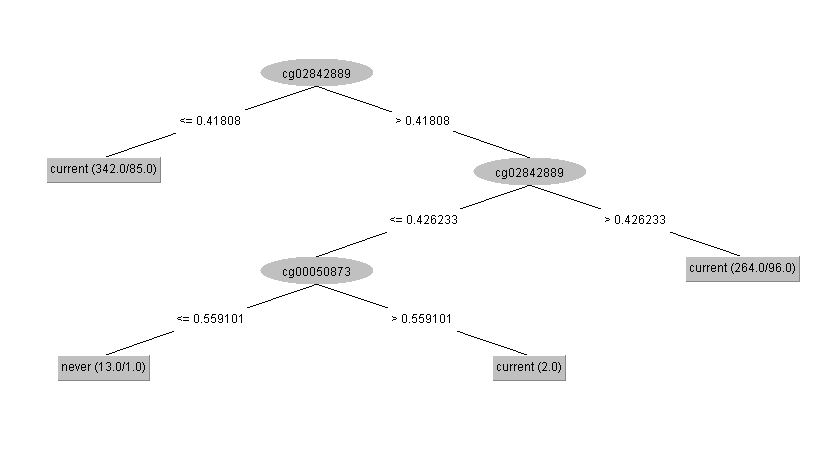
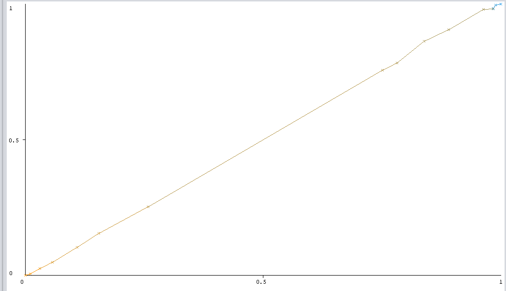
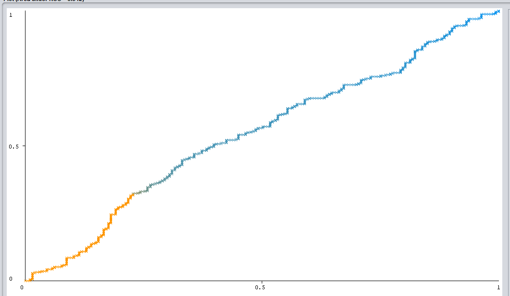

```{r setup, include=FALSE}
knitr::opts_chunk$set(echo = TRUE, fig.width = 12,fig.height = 5, warning = FALSE, message = FALSE)
options(warn = 0)
library(ggplot2, quietly = TRUE)
library(gridExtra, quietly = TRUE)
library(tidyr, quietly = TRUE)
library(pander, quietly = TRUE)
library(ggbiplot, quietly = TRUE)
library(dplyr, quietly = TRUE)
library(kableExtra, quietly = TRUE)
library(tidyverse, quietly = TRUE)
```
\newpage
# Introduction
A CpG island or CpG site is a part of the DNA where the GC content is greater than 50%. In this dataset methylation values of certain CpG sites are displayed with also the age, gender and smoking status for 671 people.

# Research Question
Is it possible to identify a person's gender, age or status of smoking given their methylation values on CpG islands?

# Data exploration
## Codebook & Reading the data
```{r}
myData <- read.csv("data/Smoker_Epigenetic_df.csv")
myData <- myData %>% drop_na()

columns = colnames(myData[1:4])
columns <- append(columns, "Columns 5-24")
names <- c("Sample Accessions numbers", "Smoking status", "Gender", "Age", "CG Island")
type <- c("chr", "chr", "chr", "int", "num")
unit <- c(NA, "current/never", "f/m", NA, NA)
descriptions = c("GSM identifier testsubject", "Wether the person is smoking or not", "Gender", "Age", "Methylation Rate of CG Island")
codebook <- data.frame(columns, names, type, descriptions)
write.csv(codebook, "Codebook.csv", row.names = FALSE)
knitr::kable(codebook)
```

## Summary

```{r CpG-tables}
subsetdata <- head(myData)
dataset <- subsetdata[1:7]
knitr::kable(dataset) %>%
  row_spec(0, bold = TRUE) %>%
  column_spec(1, bold = TRUE)

dataset <- subsetdata[c(1, 8:13)]
knitr::kable(dataset) %>%
  row_spec(0, bold = TRUE) %>%
  column_spec(1, bold = TRUE)

dataset <- subsetdata[c(1, 14:19)]
knitr::kable(dataset) %>%
  row_spec(0, bold = TRUE) %>%
  column_spec(1, bold = TRUE)

dataset <- subsetdata[c(1, 20:24)]
knitr::kable(dataset) %>%
  row_spec(0, bold = TRUE) %>%
  column_spec(1, bold = TRUE)
```
\newpage

```{r}
data_sum <- summary(myData)
data_sum
```

\newpage
# Visualization
## Distribution plots
Below there are some histograms which visualizes the distribution of smoking status, age and gender. 

```{r}
ggplot(myData, aes(x=Smoking.Status)) +
  geom_histogram(stat="count", fill = c("pink", "lightblue"), col = "black") +
  ylim(0, 600) +
  labs(caption = "Figure 1: Number of people who are smoking") +
  theme(plot.caption = element_text(size=16)) +
  theme(plot.caption = element_text(size=16, face="italic")) +
  theme(axis.text = element_text(size = 20)) +
  theme(axis.title = element_text(size = 20, face="bold"))

ggplot(myData, aes(x=Gender)) +
  geom_histogram(stat="count", fill = c("pink", "lightblue"), col = "black") +
  ylim(0, 600) +
  labs(caption = "Figure 2: Gender distribution") +
  theme(plot.caption = element_text(size=16)) +
  theme(plot.caption = element_text(size=16, face="italic")) +
  theme(axis.text = element_text(size = 20)) +
  theme(axis.title = element_text(size = 20, face="bold"))

ggplot(myData, aes(x=Age)) +
  geom_histogram(fill = "lightgrey", col = "black") +
  labs(caption = "Figure 3: Age distribution") +
  theme(plot.caption = element_text(size=16, face="italic")) +
  theme(axis.text = element_text(size = 20)) +
  theme(axis.title = element_text(size = 20, face="bold"))

```


## Plotting the data
### Scatterplots
These are all the CpG sites plotted against age, with smokin status as color groups and gender as shape groups. A few of the CpG islands have been removed, becaused they looked very similar. What stands out here is that you see two groups in almost every graph, one of men and one of women, so apparently the cg methylation rate is different between men and women.

```{r, results = FALSE}
plotfunction <- function(cg){
  ggplot(data = myData, mapping = aes_string(x = "Age", y = cg)) +
    geom_point(aes(shape = factor(Gender), color = factor(Smoking.Status))) +
    labs(caption = paste(cg, ": Scatterplot visualizing the methylation rate on this CpG island of different ages and genders.")) +
    theme(plot.caption = element_text(size=14, face="italic")) +
    theme(axis.text = element_text(size = 20)) +
    theme(axis.title = element_text(size = 20, face="bold")) +
    theme(legend.text = element_text(size = 16)) +
    theme(legend.title = element_text(size=16)) +
    ylab(paste("CpG Island: ", cg))
}
lapply(names(myData[c(5, 6, 7, 9, 10, 15, 20)]), plotfunction)

```

## Comparing two variables
With the age distribution in mind, let's try to plot 2 methylation rates with the age factored as groups.

```{r}

age.groups <- cut(myData$Age, breaks = c(20, 35, 55, 80), labels = c("20-35y", "36-55y", "55-80y"))

myData$ClassAge <- factor(age.groups)

ggplot(data = myData, mapping = aes(x = ClassAge, y = cg00050873, fill = Smoking.Status)) +
    geom_boxplot() +
    labs(caption = paste("cg00050873: Scatterplot visualizing the methylation rate on this CpG island of different ages and genders.")) +
    theme(plot.caption = element_text(size=14, face="italic")) +
    theme(axis.text = element_text(size = 20)) +
    theme(axis.title = element_text(size = 20, face="bold")) +
    theme(legend.text = element_text(size = 16)) +
    theme(legend.title = element_text(size=16)) +
    ylab(paste("CpG Island: cg00050873")) +
    xlab("Age")

ggplot(data = myData, mapping = aes(x = ClassAge, y = cg03706273, fill = Smoking.Status)) +
    geom_boxplot() +
    labs(caption = paste("cg03706273: Scatterplot visualizing the methylation rate on this CpG island of different ages and genders.")) +
    theme(plot.caption = element_text(size=14, face="italic")) +
    theme(axis.text = element_text(size = 20)) +
    theme(axis.title = element_text(size = 20, face="bold")) +
    theme(legend.text = element_text(size = 16)) +
    theme(legend.title = element_text(size=16)) +
    ylab(paste("CpG Island: cg03706273")) +
    xlab("Age")

```

# Data mining
## Quality metrics
In this week we define the best algorithm for our data with true positive, false positive, true negative and false negative.

## Algorithms
The algorithms we are going to compare are: ZeroR, OneR, J48, NaiveBayes, IBK, Simple Logistics, SMO and Random Forest. Below you can see a table with the most important results of all algorithms.

```{r}
ML_dataLoc_Smoke <- "data/Smoker_Epigenetic_dfExperimentSmoke.csv"
ML_dataLoc_Gender <- "data/Smoker_Epigenetic_dfExperimentGender.csv"
files <- list(ML_dataLoc_Smoke, ML_dataLoc_Gender)

count <- 0
for (ML_dataLoc in files)
{
  count <- count + 1
  if (count == 1)
  {
    file <- "Smoke"
  }
  else
  {
    file <- "Gender"
  }
  
  ML_data <- read.csv(ML_dataLoc)
  ML_ZeroR <- ML_data[c(1:100),]
  ML_OneR <- ML_data[c(101:200),]
  ML_J48 <- ML_data[c(201:300),]
  ML_IBK <- ML_data[c(301:400),]
  ML_NaiveBayes <- ML_data[c(401:500),]
  ML_SimpleLog <- ML_data[c(501:600),]
  ML_SMO <- ML_data[c(601:700),]
  ML_RandomForest <- ML_data[c(701:800),]
  algos <- list(ML_ZeroR, ML_OneR, ML_J48, ML_IBK, ML_NaiveBayes, ML_SimpleLog, ML_SMO, ML_RandomForest)
  
  avgs_pc <- list()
  avgs_pi <- list()
  avgs_tp <- list()
  avgs_fp <- list()
  avgs_tn <- list()
  avgs_fn <- list()
  avgs_pr <- list()
  avgs_rc <- list()
  avgs_roc <- list()

  for (algo in algos) {
    percent_correct <- algo[3]
    avg <- lapply(percent_correct, mean)
    avgs_pc[[length(avgs_pc) + 1]] <- avg
  }
  for (algo in algos) {
    percent_incorrect <- algo[4]
    avg <- lapply(percent_incorrect, mean)
    avgs_pi[[length(avgs_pi) + 1]] <- avg
  }
  for (algo in algos) {
    TP <- algo[5]
    avg <- lapply(TP, sum)
    avgs_tp[[length(avgs_tp) + 1]] <- avg
  }
  for (algo in algos) {
    FP <- algo[6]
    avg <- lapply(FP, sum)
    avgs_fp[[length(avgs_fp) + 1]] <- avg
  }
  for (algo in algos) {
    TN <- algo[7]
    avg <- lapply(TN, sum)
    avgs_tn[[length(avgs_tn) + 1]] <- avg
  }
  for (algo in algos) {
    FN <- algo[8]
    avg <- lapply(FN, sum)
    avgs_fn[[length(avgs_fn) + 1]] <- avg
  }
  for (algo in algos) {
    precision <- algo[9]
    avg <- lapply(precision, mean)
    avgs_pr[[length(avgs_pr) + 1]] <- avg
  }
  for (algo in algos) {
    recall <- algo[10]
    avg <- lapply(recall, mean)
    avgs_rc[[length(avgs_rc) + 1]] <- avg
  }
  for (algo in algos) {
    roc_area <- algo[11]
    avg <- lapply(roc_area, mean)
    avgs_roc[[length(avgs_roc) + 1]] <- avg
  }
  avgs_df <- data.frame(row.names = c("ZeroR", "OneR", "J48", "IBK", "NaiveBayes", "SimpleLogistics", "SMO", "RandomForest"))

  vec_pc <- unlist(avgs_pc)
  vec_pi <- unlist(avgs_pi)
  vec_tp <- unlist(avgs_tp)
  vec_fp <- unlist(avgs_fp)
  vec_tn <- unlist(avgs_tn)
  vec_fn <- unlist(avgs_fn)
  vec_pr <- unlist(avgs_pr)
  vec_rc <- unlist(avgs_rc)
  vec_roc <- unlist(avgs_roc)
  
  avgs_df$percent_correct_avgs <- vec_pc
  avgs_df$percent_incorrect_avgs <- vec_pi
  avgs_df$TP_sum <- vec_tp
  avgs_df$FP_sum <- vec_fp
  avgs_df$TN_sum <- vec_tn
  avgs_df$FN_sum <- vec_fn
  avgs_df$precision_avgs <- vec_pr
  avgs_df$recall_avgs <- vec_rc
  avgs_df$ROC_Area_avgs <- vec_roc
  
  knitr::kable(avgs_df)
  filepath <- paste("data/Smoker_Epigenetic_df_Summary_", file, ".csv", sep = "")
  
  write.csv(avgs_df, file = filepath)
}


```



# Conclusion & Discussion 
So far we don't have a concrete answer to the research question, because the algorithms aren't extremely overwhelming. So for now it isn't really possible to determine whether someone is smoking or not, because the data is too much spreaded out and not really divided into groups.

It's quite obvious that the percentage of correctly classified instances of every algorithm except for NaiveBayes are very close to eachother, the only significant lower scores according to weka are NaiveBayes and OneR, the best (not really significant) algorithm are surprisingly ZeroR, J48, SimpleLogistics and SMO. However it's quite remarkable that the ROC-area and the precision are the highest on NaiveBayes. So even though the results are disappointing, this is the best algorithm according to these quality metrics.

The Data with the gender as class is quite more interesting, these algorithms have a way higher area under the curve and correctly classified instance percentage.

For the Java wrapper, it is probably the best to use the data with the gender class, because this is way more reliable than the smoking status. Even though it sounds a bit odd to predict gender with the methylation rate of certain CpG islands.

One possible purpose for the use of the gender class may be for forensic research. If some suspect need to be found, it's a way to find out if the suspect is male or female.

After some research I found out what the reason for this remarkable difference is. These differences have everything to do with the diversity of the transcriptomic and proteomic profiles in the two sexes. [1]





# Sources
[1] Yusipov, I., Bacalini, M. G., Kalyakulina, A., Krivonosov, M., Pirazzini, C., Gensous, N., Ravaioli, F., Milazzo, M., Giuliani, C., Vedunova, M., Fiorito, G., Gagliardi, A., Polidoro, S., Garagnani, P., Ivanchenko, M., & Franceschi, C. (2020). Age-related DNA methylation changes are sex-specific: a comprehensive assessment. Aging, 12(23), 24057–24080. https://doi.org/10.18632/aging.202251
